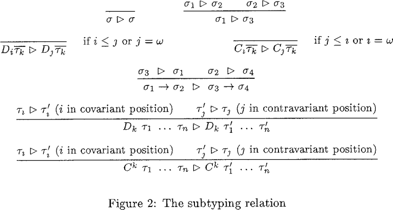

<!-- _class: lead -->

# Paper Review: Proving the Correctness of Reactive Systems Using Sized Types

Jifeng Wu

2023-03-27

------

<!-- header: Outline -->

- Background and Motivation👈
- Definitions and Notations
- Using the Type System

------

<!-- header: Background and Motivation -->

- What are Reactive Systems?👈
- What Problems Do Sized Types Intend to Solve?

------

<!-- header: What are Reactive Systems? -->

Reactive programming is a declarative programming paradigm concerned with *data streams* and the propagation of change.

In reactive programming, an attractive program structure is a set of concurrent processes known as *stream processors*. A stream processor is process that *consumes an input stream and produces an output stream*.

> Wikipedia contributors. "Reactive programming." Wikipedia, The Free Encyclopedia. Wikipedia, The Free Encyclopedia, 16 Mar. 2023. Web. 22 Mar. 2023. 

------

A class of embedded programs can be expressed as a reactive system where the control software must continuously react to the input streams by producing elements on the output streams. This is the core of more expressive formalisms that accommodate asynchronous events, non-determinism, etc.

> Hallgren, T., Carlsson, M. (1995). Programming with Fudgets. In: Jeuring, J., Meijer, E. (eds) Advanced Functional Programming. AFP 1995. Lecture Notes in Computer Science, vol 925. Springer, Berlin, Heidelberg. https://doi.org/10.1007/3-540-59451-5_5

------

<!-- header: Background and Motivation -->

- What are Reactive Systems?
- What Problems Do Sized Types Intend to Solve?👈

------

Fundamental correctness property of an embedded functional program: the computation of each stream element terminates.

Define the datatype of streams of natural numbers as:

```
data St = Mk Nat St.
```

The declaration introduces a new constructor `Mk` which, given a natural number and a stream produces a new stream, i.e., it has type `Nat -> St -> St`. Two programs that use this datatype are:

- `head (Mk n s) = n`, of type `St -> Nat`
- `tail (Mk n s) = s`, of type `St -> Nat`

------

A more interesting program is:

```
letrec ones = Mk 1 ones in ones
```

which computes an infinite stream of 1's, and the program is *productive* (a request for the first i elements of the stream is guaranteed to be processed in finite time).

------

```python
import inspect
import sys


def mk(integer, stream, indent_level=0):
    indent = '    ' * indent_level
    print(indent, inspect.currentframe(), file=sys.stderr)

    yield integer
    yield from stream


def create_ones(indent_level=0):
    indent = '    ' * indent_level
    print(indent, inspect.currentframe(), file=sys.stderr)

    yield from mk(1, create_ones(indent_level + 1), indent_level + 1)
```

------

```python
In [2]: ones = create_ones()                                                    

In [3]: next(ones)                                                              
 <frame at 0x7f6358731200, file '<ipython-input-1-bad85f883e32>', line 15, code create_ones>
     <frame at 0x7f6358737040, file '<ipython-input-1-bad85f883e32>', line 7, code mk>
Out[3]: 1

In [4]: next(ones)                                                              
     <frame at 0x2995df0, file '<ipython-input-1-bad85f883e32>', line 15, code create_ones>
         <frame at 0x298ee60, file '<ipython-input-1-bad85f883e32>', line 7, code mk>
Out[4]: 1

In [5]: next(ones)                                                              
         <frame at 0x7f635a03a5e0, file '<ipython-input-1-bad85f883e32>', line 15, code create_ones>
             <frame at 0x7f635a1e99f0, file '<ipython-input-1-bad85f883e32>', line 7, code mk>
Out[5]: 1
```

------


However,

```
letrec ones' = Mk 1 (tail ones') in ones'
```

is not productive; it cannot compute the first i elements of the stream for any i > 1.


------

```python
def tail(stream, indent_level=0):
    indent = '    ' * indent_level
    print(indent, inspect.currentframe(), file=sys.stderr)

    discarded = next(stream)

    print(indent, f'{discarded} discarded in {inspect.currentframe()}', file=sys.stderr)
    yield from stream


def create_ones_(indent_level=0):
    indent = '    ' * indent_level
    print(indent, inspect.currentframe(), file=sys.stderr)

    yield from mk(
        1,
        tail(
            create_ones_(
                indent_level + 1
            ),
            indent_level + 1
        ),
        indent_level + 1
    )
```

------

```
ones_ = create_ones_()
for i in ones_:
    print(f'Got {i} from ones_', file=sys.stderr)
```

Infinite unbounded recursion happens after 'Got 1 from ones_':

```
 <frame at 0x7f8abf1199f0, file 'ones_.py', line 32, code create_ones_>
     <frame at 0x7f8abf0283e0, file 'ones_.py', line 7, code mk>
Got 1 from ones_
     <frame at 0x7f8abf028210, file 'ones_.py', line 22, code tail>
     <frame at 0x7f8abf119040, file 'ones_.py', line 32, code create_ones_>
         <frame at 0x7f8abf028780, file 'ones_.py', line 7, code mk>
     1 discarded in <frame at 0x7f8abf028210, file 'ones_.py', line 26, code tail>
         <frame at 0x7f8abf0285b0, file 'ones_.py', line 22, code tail>
         <frame at 0x7f8abf170740, file 'ones_.py', line 32, code create_ones_>
             <frame at 0x7f8abf028b20, file 'ones_.py', line 7, code mk>
         1 discarded in <frame at 0x7f8abf0285b0, file 'ones_.py', line 26, code tail>
```

------

```
letrec ones' = Mk 1 (tail ones') in ones'
```

Assume that after unfolding the recursion a number of times, we obtain a stream s with `i + 1` elements.

The recursive call then computes `(tail s)` which has `i` elements and adds one element to produce a stream that has `i + 1` elements.

Each recursive call is attempting to construct a stream with no more elements than the previous call and no new elements are added to the stream after the first one.

------

Represent streams with at least $i$ elements with the family of types ${St}^{i}$.

We can express more infromative types for `Mk`, `head`, and `tail`:

- `data St = Mk Nat St.`: $\forall i. Nat \rightarrow {St}^{i} \rightarrow {St}^{i + 1}$
- `head (Mk n s) = n`: $\forall i. {St}^{i + 1} \rightarrow Nat$
- `tail (Mk n s) = s`: $\forall i. {St}^{i + 1} \rightarrow {St}^{i}$

------

```
letrec ones = Mk 1 ones in ones
```

- `ones`: ${St}^{i}$
- `Mk 1 ones`: ${St}^{i + 1}$

```
letrec ones' = Mk 1 (tail ones') in ones'
```

- `ones'`: ${St}^{i + 1}$
- `tail ones'`: ${St}^{i}$
- `Mk 1 (tail ones')`: ${St}^{i + 1}$

------

Using this representation, we can also establish that some functions are unsafe as their computation requires unbounded space.

```
letrec fil (Mk n1 (Mk n2 s)) = Mk (avg n1 n2) (fil s) in λs.stream-add (fil s) (fil (fil s))
```

According to `fil (Mk n1 (Mk n2 s)) = Mk (avg n1 n2) (fil s)`, if a stream `s` contained the elements $n_1, n_2, n_3, n_4, \dots$, `fil s` would return a stream containing the elements $\frac{n_1 + n_2}{2}, \frac{n_3 + n_4}{2}, \frac{n_5 + n_6}{2}, \dots$. Thus, the type of `fil` should be $\forall i. {St}^{2i} \rightarrow {St}^{i}$.

------

For every $i$ output elements, we need $4i$ input elements. These elements are all consumed along the bottom path. However, only $2i$ elements are consumed along the top path, and the remaining elements must be buffered.

It is impossible
to implement a buffer of size $2i$ for all $i$.


------

<!-- header: Outline -->

- Background and Motivation
- Definitions and Notations👈
- Using the Type System

------

<!-- header: Definitions and Notations -->

- Datatypes👈
- Type System

------

<!-- header: Datatypes -->

- `data`: the user is interested in *finite elements* of the datatype
  - `data Nat = Zero + Succ Nat`
  - `data List t = Nil + Cons t (List t)`
- `codata`: the user is also interested in the *infinite elements* of the datatype
  - `codata St t = Mk t (St t)`

------

With each datatype name, our system associates a family of types.

- For `data`, it is represented with a *size index subscript* representing the elements of the datatype with the given size bound.
  - $Nat_3$ represents the natural numbers $\{0, 1, 2\}$
  - $List_3 t$ represents all lists with fewer than $3$ elements of type $t$.
- For `codata`, it is represented with a *size index superscript*.
  - $St^3 t$ represents all streams with at least 3 elements of type $t$.
  - $St^{\omega} t$ represents all infinitie streams with elements of type $t$.

------

Valid size indexes include:

- natural numbers
- natural number *size variables*, e.g. $i$
- the special index $\omega$
- *linear functions* of the size variables

The precise type for $factorial$ would be $\forall i . Nat_i \rightarrow Nat_{i!}$. However, the best type we can express for $factorial$ is $\forall i . Nat_i \rightarrow Nat_{\omega}$.

------

There are several sections in the paper which I couldn't understand:

- 3.2 Semantics of Expressions
- 3.3 The Universe of Types
- 3.4 Continuity and Ordinals
- 3.5 Semantics of Types
- 3.6 Testing for $\bot$
- 3.7 $\omega$-Types

------

<!-- header: Definitions and Notations -->

- Datatypes
- Type System👈

------

The subtyping relation

Perks:

- `data` datatypes require $i \le j$ for $D_i$ to be a subtype of $D_j$.
- `codata` datatypes rquire $j \le i$ for $C_i$ to be a subtype of $C_j$. 



------

The main innovation in our type inference system is the rule for typing recursive declarations.


The second premise states that should `x` occur *within* `M` with type $\tau$, it should have the "next" size ($\tau[i + 1 / i]$) *on the left hand side*.

- `data` computations terminate
- `codata` computations are productive


------

The first premise, known as the "bottom check", ensures that we can start the iteration of the functional in the first place.

- Set all natural number *size variables*, e.g. $i$, to 0, to get a type $\tau[0 / i]$.
- If $\tau[0 / i]$ is not empty, check whether *any* term is a valid term of $\tau[0 / i]$.


------

The "bottom check" is very important.

`s = if head s then Mk True s else Mk False s`

Assuming that the right hand side `s` is of type ${St}^{i + 1}$ (required due to `head s`), the left hand side `s` is of type ${St}^{i + 2}$.

- ${St}^{i + 1} \rightarrow {St}^{i + 2}$ satisfies the second premise. The functional is making progress at each recursive call.
- However, the "bottom check" fails.
  - $\tau[0 / i] = {St}^{1}$.
  - ${St}^{1}$ is not empty.
  - $\bot$ (empty stream) is not a term of ${St}^{1}$.
- The program will be correctly rejected.

------

Rules for Type Inference (1)

- Var: variable
- Abs: procedure
- App: application
- Con: constructor
  - the type of the constructor $\sigma_{Con}$ is inferred from the datatype declaration


------

Rules for Type Inference (2)

- Gen, Inst: Generalize and instantiate *type schemes*.
- GenS, InstS: Generalize and instantiate *size variables*.


------

Rules for Type Inference (3)

- Coer: Coerce a type to a less precise one by relaxing the bounds on the sizes.
- $\omega$: Instantiate size variables that index $\omega$-undershooting type expressions to $\omega$.
- Rec: Ensure that the resulting computations are terminating and/or productive when typing recursive declarations.


------

<!-- header: Outline -->

- Background and Motivation
- Definitions and Notations
- Using the Type System👈

------

<!-- header: Using the Type System -->

Assume that `append` has type $\forall i . \forall j . \forall t . List_i t \rightarrow List_{j + 1} t \rightarrow List_{i + j} t$.

We can prove that `reverse` has type $\forall i . \forall t . List_i t \rightarrow List_i t$:


```
reverse xs = 
    case xs of
        Nil -> Nil
        Cons y ys -> append (reverse ys) (Cons y Nil)
```

------

- `Nil -> Nil`: assume `xs` has type $List_i t$. In this case, `reverse xs` has type $List_i t$, and `reverse` has type $\forall i . \forall t . List_i t \rightarrow List_i t$. ✅
- `Cons y ys -> append (reverse ys) (Cons y Nil)` case, assume `reverse` has type $\forall i . \forall t . List_i t \rightarrow List_i t$ on the right hand side, `ys` has type $List_i t$.
  - `y` has type $t$, `xs` has type $List_{i + 1} t$.
  - `reverse ys` has type $List_i t$, `Cons y Nil` has type $List_2 t$ (because it is a list with length 1).
  - `append (reverse ys) (Cons y Nil)` has type $List_{i + 1} t$, `reverse` has type $\forall i . \forall t . List_{i +1} t \rightarrow List_{i + 1} t$ on the left hand side. ✅
- Bottom check: $List_0 t \rightarrow List_0 t$. $List_0 t$ is empty, pass. ✅

------

Automated Type Checker

- Requires all let-bound variables to be annotated with sized type signatures, but infers the types for all other expressions.
- Proof strategy:
  - Uses Var, Abs, App, Con, Case, Rec according to the structure of the program.
  - Inst, InstS with Var, Con.
  - Gen, GenS with Rec.
  - Coer with App, Con, Case.


------

- Generates a system of inequalities based on
  - Size constraints whenever Coer is used.
  - All size variables are `Nat`'s (integers >=0).
- Solved using a constraint solver.


------

Three major steps of the algorithm:

- Hindley Milner Inference: check that the program is type correct in terms of ordinary types.
- Size Inference.
- Constraint Solving and Bottom Check.

------

However, I don't quite understand the implementation details in 6.2. Specifically, whose sizes are these in the constraints?


